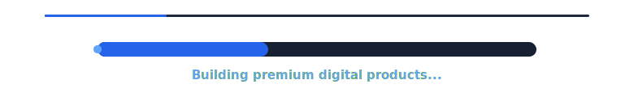

<div align="center">


<br/>

<a href="https://heyitskunal.vercel.app/">
  
</a>
&nbsp;
<a href="https://www.linkedin.com/in/kunalldev">
  
</a>
&nbsp;
<a href="mailto:kkunaall10@gmail.com">
  
</a>
&nbsp;


<br/><br/>


<br/><br/>



<br/><br/>

</div>

---

<div align="center">

# KUNAL  
## DEVELOPER

**15-year-old builder · Frontend Developer · UI/UX focused · Full-stack learner**

Building visually stunning and high-performance web experiences.  
Turning ideas into interactive products with clean UI, strong structure and real-world usability.

</div>

---

## About Me

```ts
const kunal = {
  name: "Kunal Dev",
  username: "Kunal17711",
  role: "Web, App & UI/UX Developer",
  location: "Haryana, India",

  identity: [
    "15-year-old builder",
    "Frontend developer",
    "UI/UX focused creator",
    "Open-source contributor",
    "Real product builder"
  ],

  stack: {
    frontend: ["React", "Next.js", "TypeScript", "Tailwind CSS"],
    mobile: ["React Native", "Expo"],
    backend: ["Supabase", "Firebase", "Node.js"],
    tools: ["Git", "GitHub", "Vercel", "Figma", "VS Code"]
  },

  focus: [
    "Clean interfaces",
    "Responsive layouts",
    "Smooth user experience",
    "Real backend integration",
    "Performance-focused development"
  ],

  mission: "Design premium interfaces and ship useful digital products."
};
```

---

## Portfolio Style Projects

<div align="center">

| Project | Category | Description | Link |
| --- | --- | --- | --- |
| **Portfolio** | Personal Brand | My personal developer portfolio with premium UI and selected work | [View](https://heyitskunal.vercel.app/) |
| **Vidora** | Creator Platform | Video/creator focused digital platform with clean modern interface | [View](https://vidora.co.in/) |
| **Raksha** | Safety Product | Women safety app and smart wearable safety-card product concept | [View](https://get-raksha.web.app/) |
| **WishWrap** | Digital Product | Digital gifting and wish-based product experience | [View](https://wishwrap.in/) |
| **PicPrompt** | AI Product | Prompt-focused AI product website | [View](https://www.picprompt.shop/) |
| **Paradox Verse** | Creative Web | Creative interactive web experience | [View](https://paradox-verse.web.app/) |

</div>

---

## What I Build

<div align="center">

| Area | Work |
| --- | --- |
| **Websites** | Portfolio sites, landing pages, product websites |
| **Web Apps** | Dashboards, SaaS-style UI, admin panels |
| **Mobile Apps** | Expo React Native apps with clean screens and real flows |
| **UI/UX** | Modern layouts, responsive design, visual systems |
| **Backend Integration** | Supabase, Firebase, auth, database, storage |
| **Launch** | GitHub, Vercel, deployment and project presentation |

</div>

---

## Current Focus

<div align="center">

| Product | What I am building | Stack |
| --- | --- | --- |
| **Raksha** | Women safety mobile app with SOS, Safety PIN, trusted contacts and wearable safety-card concept | Expo, React Native, Supabase |
| **EduNest** | School management app for principal, teachers, parents and students | Expo, TypeScript, Supabase |
| **FixNear** | Home-services booking app for local workers and customers | Expo, Supabase |
| **Open Source** | Real-world PRs, bug fixes, docs improvements and security cleanup | GitHub, Node.js, React |

</div>

---

## Tech Stack

<div align="center">


<br/><br/>


</div>

---

## Open Source Proof

<div align="center">

| Repository | Contribution | PR |
| --- | --- | --- |
| **FitMart** | Cleaned `.env.example` formatting and added missing env placeholder | `#234` |
| **FitMart** | Improved logger security by redacting sensitive request body data | `#235` |

</div>

---

## Contribution Snake

<div align="center">


</div>

---

## GitHub Stats

<div align="center">


</div>

---

## Streak

<div align="center">


</div>

---

## Activity Graph

<div align="center">


</div>

---

## Profile Summary

<div align="center">


<br/><br/>


</div>

---

## Trophies

<div align="center">


</div>

---

## Contact

<div align="center">

<a href="https://heyitskunal.vercel.app/">
  
</a>
&nbsp;
<a href="https://www.linkedin.com/in/kunalldev">
  
</a>
&nbsp;
<a href="mailto:kkunaall10@gmail.com">
  
</a>

<br/><br/>


</div>

---

<div align="center">


</div>